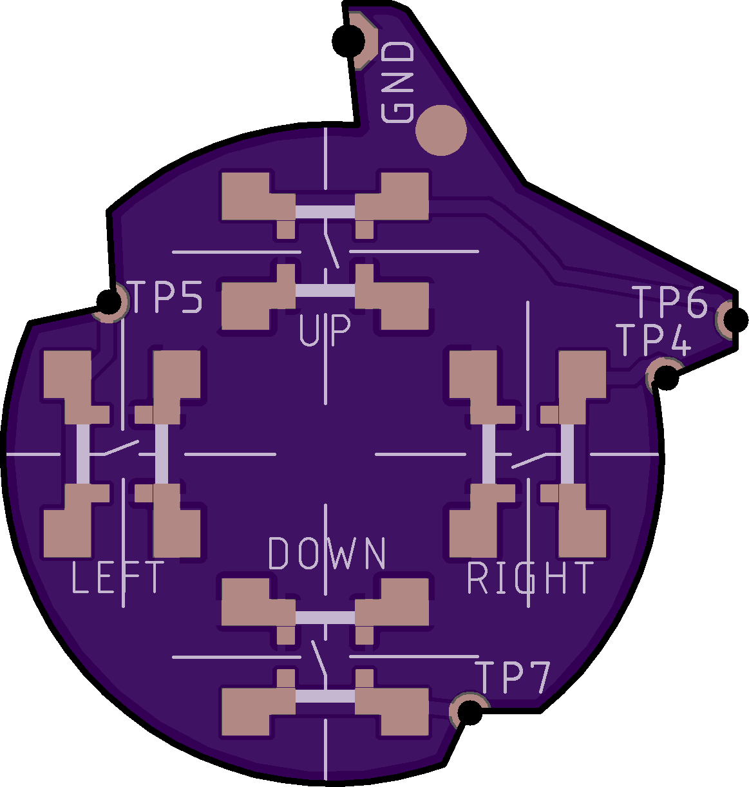
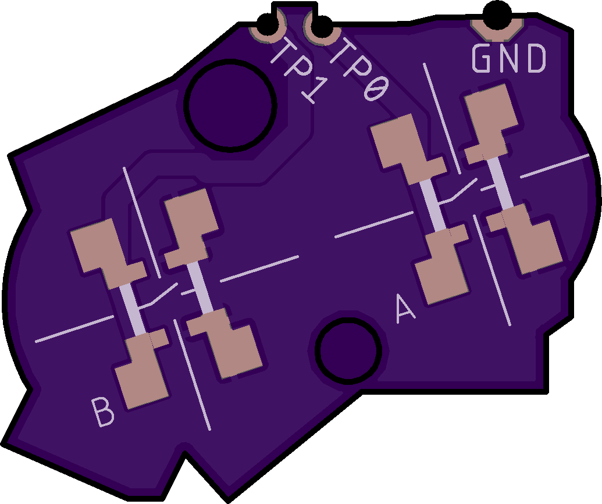

# AGB_TACT v2

Tact switch mod for the Game Boy Advance (clicky buttons like the GBA SP but for
regular GBA).

The goal behind this mod is to allow AGB consoles to be repaired (or just
converted) from regular membrane buttons over to the tact switches that GBA SP
consoles use.

Contact pads are designed to accomodate a wide variety of buttons.

## Ordering boards

I've uploaded both boards to OSHPark: [DPad](https://oshpark.com/shared_projects/HXDz5vQI),
[A and B](https://oshpark.com/shared_projects/JWpZMYHv). Best to order them as
flex PCBs to have them as thin as possible.

Gerbers are available in `gerbers` directory.

## Installation

Soldering PCBs to GBA main board is pretty straightforward: line up holes with
corresponding test pads and solder them down.

When soldering buttons, try to center them as best as you can. On DPad this can
make big difference in how they will feel during use.

Next steps depend on the height of the buttons you're using.

### ~0.6mm buttons

For example, ALPS SKRRAAE010 sourced from
[mouser](https://www.mouser.com/ProductDetail/ALPS/SKRRAAE010/?qs=m0BA540hBPeKhAe3239t1w==)
or [lcsc](https://lcsc.com/product-detail/Tactile-Switches_ALPS-Electric-SKRRAAE010_C97437.html).

Depending on circumstances, you might need to add small cardboard pieces onto
each conductive pad on the membranes (pads on aftermarket membranes can be quite
soft and spongy, which doesn't feel great when you're trying to press a tactile
switch). You will probably also need to add cardboard pieces in the middle of
DPad board in order to lift the DPad a bit and prevent it from pressing too many
buttons at once. See the [video](https://youtu.be/q93zTNmFXSk) for more details.

### ~1.5mm buttons

I've tried the following buttons, in the order of preference:

* ALPSALPINE SKQGABE010 - ~160gf, 0.25mm travel, 500k cycles ([lcsc](https://lcsc.com/product-detail/Tactile-Switches_ALPSALPINE-SKQGABE010_C115351.html))
* XKB Connectivity TS-1187A-B-B-B - 160gf, 0.2mm travel ([lcsc](https://lcsc.com/product-detail/Tactile-Switches_XKB-Connectivity-TS-1187A-B-B-B_C528026.html))
    * Quite a bit louder than the above
* Diptronics TBEG-W-Q-T/R - 200gf, 0.12mm travel, 200k cycles ([lcsc](https://lcsc.com/product-detail/Tactile-Switches_Diptronics-TBEG-W-Q-T-R_C495931.html))
    * Too fiddly to solder
* XKB Connectivity TS-1187A-C-A-B - 260gf, 0.2mm travel ([lcsc](https://lcsc.com/product-detail/Tactile-Switches_XKB-Connectivity-TS-1187A-C-A-B_C480267.html))
    * Turned out to be a bit too stiff

To make them work you'll need to trim about 1mm from the rubber membranes. On
the aftermarket membranes I have, that amounted to just gently cutting off
conductive pads with a knife, flush to the rest of the membrane.

Additionally, you'll need to stick something about 0.6mm thick in the middle of
DPad PCB in order to prevent DPad from activating too many buttons at once.
Adhesive pad that came with the IPS display worked pretty well in my case.

## Changes in v2.1

* Test pad holes drill diameter reduced to 1mm
* All test pads now have cutouts for easier soldering
* TP6 pad changed to remove overlap with nearby RESET pad on the main board
* GND pad on DPad board moved a bit to the left, reducing the distance to shoulder button
