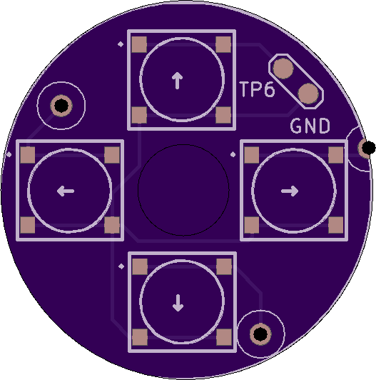
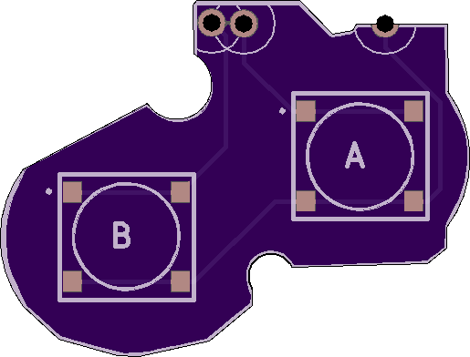

# AGB_TACT
Tact switch mod for the Game Boy Advance (clicky buttons like the GBA SP but for regular GBA)

The goal behind this mod is to allow AGB consoles to be repaired (or just converted) from regular membrane buttons over to the tact switches that GBA SP consoles use. 

I've only just created (and ordered) the PCBs so I do not yet know if they work well or may need other tweaks but I will upload the files here for anyone else to tinker with. These PCBs likely need to be ordered as flex PCBs in order to be as thin as possible. 

These are the buttons that are needed: ALPS SKRRAAE010 sourced from [mouser](https://www.mouser.com/ProductDetail/ALPS/SKRRAAE010/?qs=m0BA540hBPeKhAe3239t1w==) or [lcsc](https://lcsc.com/product-detail/Tactile-Switches_ALPS-Electric-SKRRAAE010_C97437.html)
